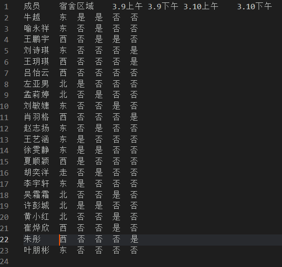

# 功能说明

这是专门用来给我所在的进行二手书籍流转工作的学生组织“二号阅读室”进行收书活动的人员排班的程序。

排班的要求是：

- 所有值班时间都有人员值班
- 所有被安排在某值班时间的人员在该值班时间**空闲**
- 进行值班的地点距离人员所在的宿舍区域不要太远
- 所有人的总值班次数不超过两次，在上午值班次数不超过一次

程序需要实现的功能有：

- 根据特定格式的数据文件给出排班结果
- 能够修改人员安排的权重？？？

# 数据处理

## 数据输入

使用excel表格，得到如下格式的文件"data.txt"：

## 数据输出

数据输出在本地目录下的“值班安排结果.txt”文件中。

# 程序执行过程

## 读取文件

**获取信息：**

文件行数`line_count`

文件列数`col_count`

包含文件**全部**内容的二维元组`table`

读取文件时执行格式检查：`check_format()  # 检查每一行的单词数是否相同`

## 创建二部图

**信息来源**：`table`

### 创建顶点集合

**创建人员顶点集合**：`employee`

**创建值班时间顶点集合**：`on_duty_time`

**创建顶点名称和编号的对应关系**：`employee_table`和`on_duty_time_table`

### 创建人员信息

使用Employee类来管理employee的相关信息

人员与其值班次数的对应关系：`on_duty_count`

人员与其所在宿舍区域的关系？？？

### 创建“人员-值班时间”二部图

根据`table`的行列数信息读取`table`，得到两个顶点集合之间的边集。

从一个矩阵和两个元组初始化一个二部图

可以计算这个二部图的最大匹配的边集，同时删除已匹配的边

可以反复计算，得出多个最大匹配的边集，边集先是顶点编号形式，然后是顶点名称形式

### 创建“人员-值班地点”二部图

根据某一值班时间中的人员集合创建该二部图的人员集合。

根据人员与宿舍的对应关系，得到人员与各个值班地点的权重。权重越小，消耗越小。

| 宿舍/值班地点 | 东区 | 西区 | 北区 |
|:-------:|:--:|:--:|:--:|
|    东    | 0  | 1  | 1  |
|    西    | 1  | 0  | 2  |
|    北    | 1  | 2  | 0  |
|   新北    | 2  | 3  | 1  |

这可以使用一个**二维词典**实现

# 算法的问题

确实，"匈牙利算法"这个术语有时会被混淆。它最初是由匈牙利数学家Édmond Hlawka和哈罗德·库恩（Harold Kuhn）分别独立提出的，用于解决二部图的最大匹配问题。然而，随着时间的推移，这个术语也被用来指代解决一般加权匹配问题的算法，即Kuhn-Munkres算法，它是一种在多项式时间内找到加权图中最大匹配的算法。

## 匈牙利算法（二部图最大匹配）：

- 用于解决二部图的最大匹配问题。
- 通过增广路径来增加匹配的大小。
- 匈牙利算法的一个变体是Hopcroft-Karp算法，它对原始的匈牙利算法进行了优化，减少了迭代次数。

## Kuhn-Munkres算法（最大权匹配）：

- 用于解决加权图中的最大权匹配问题。
- 通过线性规划的松弛来找到权重和最大的匹配。
- 该算法也被称为匈牙利算法的一种变体，因为它在概念上与原始的匈牙利算法相似，特别是在使用增广路径的概念上。

## 混淆的原因：

- 两者都使用了类似的增广路径概念。
- 原始的匈牙利算法和Kuhn-Munkres算法在某些情况下可以互相转换或等价。
- 术语的使用不够严格，有时人们会将Kuhn-Munkres算法简称为匈牙利算法。
